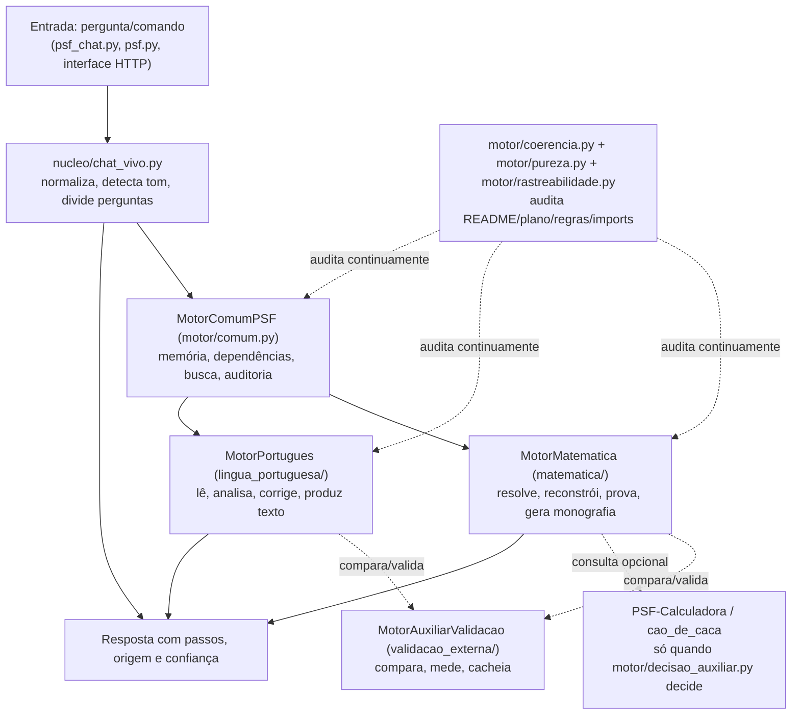

# Arquitetura do PSF-IAminy

Este documento explica como as peças do projeto se encaixam, para que ninguém precise deduzir a arquitetura lendo o código inteiro. Ele descreve estrutura; não substitui as regras de `REGRA_INTEGRIDADE.md` nem o estado detalhado do `README.md`.

## Visão geral

As setas pontilhadas marcam serviços de apoio (comparação, validação, auditoria) que nunca produzem conhecimento por conta própria — só o `MotorMatematica` e o `MotorPortugues` fazem isso, cada um no seu domínio.

## Componentes

### Motor Matemática (`matematica/`, `nucleo/*`, `conhecimento/ETAPA_*.md`)

Resolve expressões racionais com precedência, reconstrói divisão por quociente/resto/fração/decimal, executa prova formal no fragmento lógico finito e produz monografia como consolidação. Cada conceito matemático precisa de uma ponte de dependências auditável (`matematica/conhecimento.py`); sem ponte, o conteúdo fica como legado/candidato, nunca como conhecimento pronto. Hipóteses autorais (`matematica/hipoteses.py`) ficam preservadas separadamente, sem virar algoritmo confiável antes de prova ou falsificação.

### Motor Português (`lingua_portuguesa/`)

Constrói o conhecimento linguístico numa única linha canónica (`lingua_portuguesa/conhecimento_puro.py`): fonética, morfologia, sintaxe, semântica, pragmática, até produção textual. Léxico próprio (`lingua_portuguesa/lexico.py`) e corretor ortográfico de sessão são internos; não importam o núcleo matemático — a ponte fica isolada em `lingua_portuguesa/ponte_matematica.py`, que só compara/audita, nunca decide o conteúdo linguístico.

### Motor Comum PSF (`motor/comum.py`, `motor/geral.py`)

Presta serviços de memória, dependências, busca e auditoria aos dois domínios, sem produzir verdade matemática nem linguística. `motor/geral.py` (`MotorGeralIAMiny`) é a fachada que orquestra os três motores (Matemática, Português, Auxiliar) numa mesma chamada.

### Motor auxiliar de validação (`validacao_externa/`)

`MotorAuxiliarValidacao` é único e compartilhado pelos dois domínios sem misturá-los. Pode usar bibliotecas eficientes só para comparar, medir, cachear e apontar divergência — nunca para criar conhecimento, prova ou verdade linguística.

### PSF-Calculadora / `cao_de_caca/` (subprojeto externo)

Ferramenta de cálculo independente (própria `pyproject.toml`, própria suíte de testes, fora da coleta padrão de `pytest`), que abusa de propósito de dependências científicas pesadas (NumPy, SciPy, SymPy, Pandas, Matplotlib, NetworkX, mpmath, scikit-learn). `motor/decisao_auxiliar.py` decide, por 4 perguntas explícitas, quando vale consultá-la; o mapa de conhecimento a cataloga com zero arestas para Matemática/Português. Ver a seção correspondente em `README.md` para detalhe.

### Auditoria, pureza e rastreabilidade (`motor/coerencia.py`, `motor/pureza.py`, `motor/rastreabilidade.py`)

Três verificadores que comparam documento com código real, em vez de confiar em prosa:

- `motor/coerencia.py`: README, plano, regras e números documentados batem com o estado real do motor (numeração do plano, auditoria estrutural de Português, léxico, contagem de testes entre `README.md`/`COMO_RODAR.md`, regra de versão única, imports de `interface/`).
- `motor/pureza.py`: lê os imports reais de cada módulo (via AST) e confere contra a lista explícita do que esse módulo não pode usar como dependência proibida.
- `motor/rastreabilidade.py`: confirma que toda referência a ficheiro citada numa ETAPA aponta para um ficheiro real, que nenhum módulo em `nucleo/` fica sem etapa, e detecta import Python quebrado (módulo/atributo/sintaxe) sem executar o código auditado.

Essas três verificações rodam como testes reais em `testes/test_coerencia_readme_plano_relatorio_regras.py` — não são scripts que alguém precisa lembrar de rodar manualmente.

### Interface (`interface/`)

`interface/roteador.py` contém a lógica HTTP pura (testável sem abrir socket); `interface/servidor.py` é a casca fina que liga isso a `http.server` da biblioteca padrão (sem Flask/FastAPI). `interface/conversas.py` grava conversas automaticamente em `interface/dados/conversas/*.json` (fora do controlo de versão). `interface/mapa_conhecimento.py` e `interface/mapa_cao_de_caca.py` expõem o grafo de conceitos para a página estática em `interface/estatico/`.

### Dados (`dados/`)

`dados/base_canonica.jsonl` guarda a base canónica de perguntas/respostas puras; foi esvaziada deliberadamente numa limpeza anterior (ver `COMO_RODAR.md`) e é reconstruída por materialização PSF, não por importação de conteúdo pronto. Dados de sessão (conversas, logs de auditoria/falha do chat vivo) ficam fora do repositório (`.gitignore`).

## Fluxo de entrada e saída

1. **Entrada**: `psf_chat.py "pergunta"`, `psf.py --pergunta "..."`, ou `POST` na interface HTTP.
2. **`nucleo/chat_vivo.py`**: normaliza o texto, detecta tom, divide em sub-perguntas quando necessário, e delega para a rota certa (`nucleo/chat_rotas*.py`).
3. **Motor comum** decide qual domínio(s) atender e injeta memória/dependências/busca.
4. **Motor Matemática ou Português** produz o resultado com os passos de construção (nunca só o valor final).
5. **Auxiliar/validação externa**, quando aplicável, compara ou mede — não decide o conteúdo.
6. **Saída**: texto de resposta + origem + confiança (`RespostaChat`), ou JSON via `--json`/API HTTP.

## O que este documento não é

Não é uma promessa de API estável nem uma proposta de reestruturação (ver item 11 do plano de melhorias sobre uma eventual estrutura `src/`, deliberadamente não aplicada ainda). É uma fotografia de como as peças existentes se relacionam hoje.
