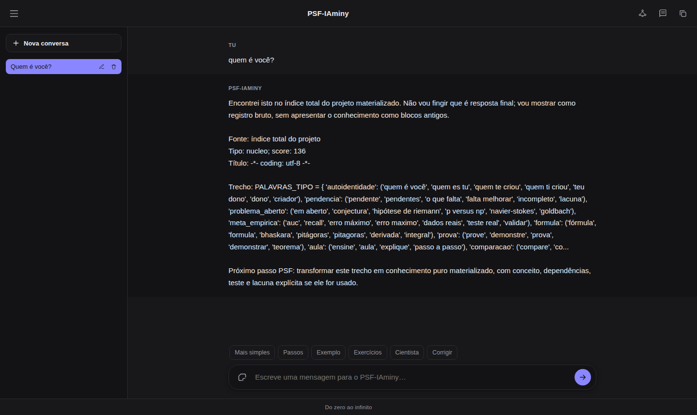
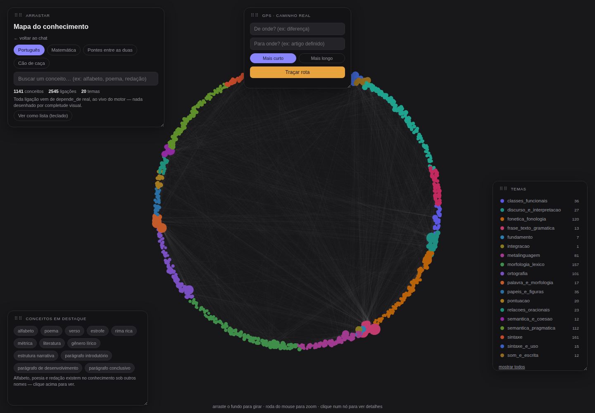
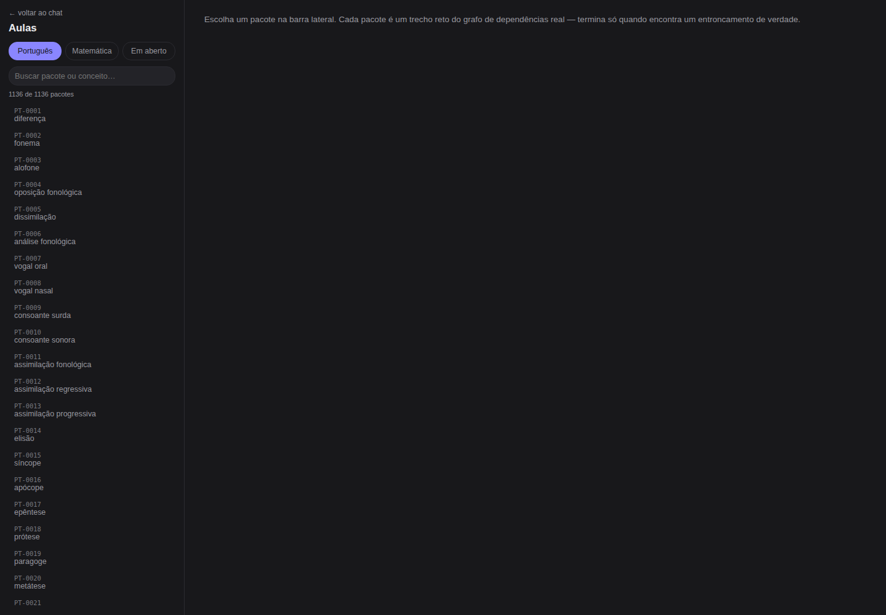
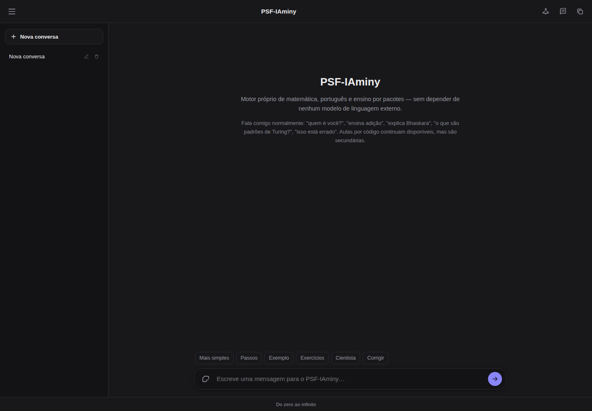
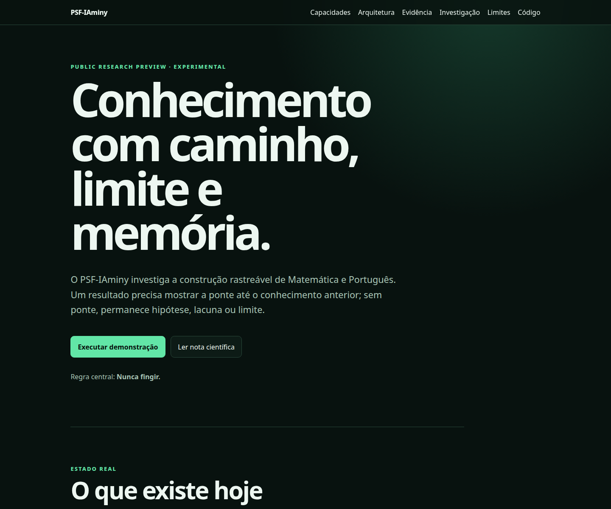

# Capturas reais

Estas imagens foram produzidas em 17 de julho de 2026 a partir da árvore local
do projeto. Não são mockups, respostas reescritas nem dados preparados à mão.
A interface foi ligada a um armazenamento temporário isolado, apagado depois
da captura; nenhum histórico persistente do utilizador entrou nas imagens.

## Entrada, resposta, origem e limite

A pergunta `quem é você?` foi enviada pela rota HTTP real. A captura preserva
o resultado tal como o motor o devolveu: fonte e score do índice, trecho bruto
e a admissão de que aquilo ainda não é uma resposta final materializada. Isso
é evidência tanto de rastreabilidade quanto de uma limitação atual do chat.

## Mapa de conhecimento

O navegador carregou `mapa.html` contra `/api/mapa` no servidor real. A imagem
mostra os 1.141 conceitos e 2.545 ligações reportados pelo motor nessa data;
as posições do grafo são visualização, não uma prova de completude.

## Ensino derivado do grafo

A área de aulas carregou 1.136 pacotes reais. Nenhuma aula foi selecionada na
captura, portanto a imagem prova a listagem e a navegação inicial, não a
qualidade pedagógica de cada pacote.

## Estado inicial da interface

Uma conversa vazia e genérica foi criada no armazenamento temporário para
mostrar o estado de boas-vindas. Não contém texto de sessão nem dados pessoais.

## Prévia da página pública

A página foi servida diretamente da pasta `site/`. É uma prévia local: o
workflow de GitHub Pages existe, mas a página ainda não deve ser chamada de
publicada enquanto esse workflow não rodar com sucesso na branch `main`.

## Protocolo de captura

1. O `ThreadingHTTPServer` real foi iniciado em `127.0.0.1` com
   `Roteador(ArmazemConversas(...))` apontando para um diretório temporário.
2. A conversa foi criada e a mensagem enviada pelas rotas `/api/conversas` e
   `/api/conversas/{id}/mensagens`, sem chamar o motor diretamente.
3. Chromium headless abriu as páginas reais. Na conversa, o protocolo de
   depuração do próprio navegador apenas acionou o botão já existente; a
   imagem veio de `Page.captureScreenshot` depois da renderização.
4. Mapa e ensino foram carregados pelo JavaScript público contra as APIs do
   mesmo servidor isolado.
5. O servidor, a conversa e o perfil temporário do navegador foram encerrados
   e removidos. Os únicos artefactos preservados são estes PNG públicos.

Capturas não substituem testes de acessibilidade, integração ou correção. O
teste HTTP de ponta a ponta continua em `testes/test_interface_e2e_http.py`.
