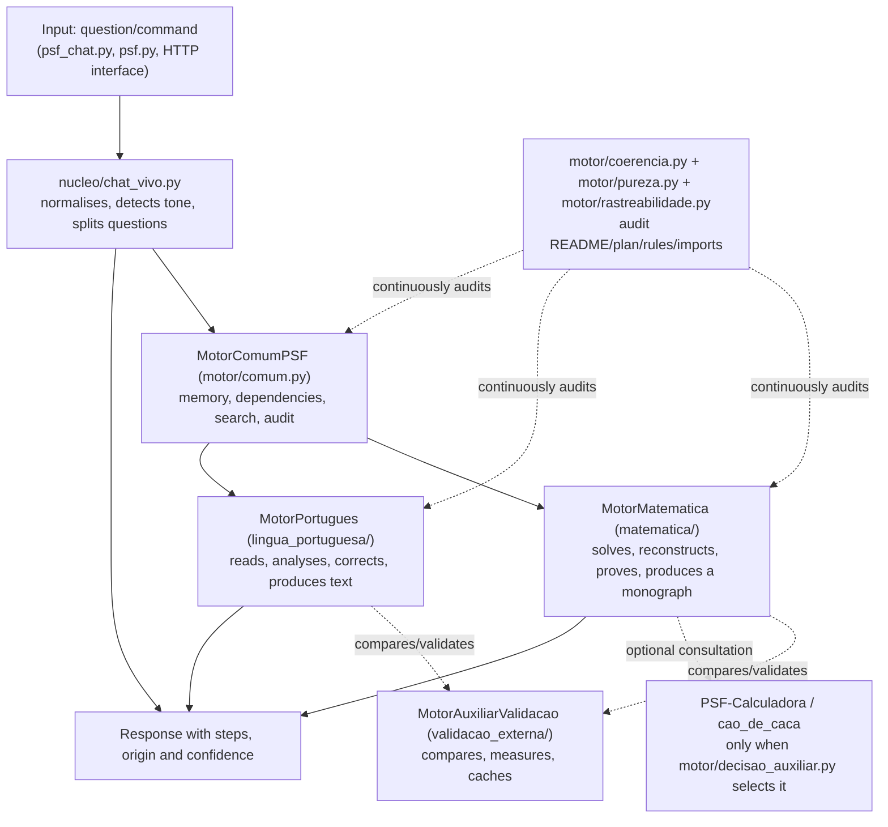

# PSF-IAminy architecture

This is an English translation of the canonical Portuguese
[architecture document](../ARQUITETURA.md). It explains how the existing
project components fit together so that readers do not need to infer the
architecture from the entire codebase. It describes structure; it does not
replace `REGRA_INTEGRIDADE.md` or the detailed status in `README.md`.

## Overview

Dashed arrows identify support services (comparison, validation and audit).
They never produce knowledge themselves: only `MotorMatematica` and
`MotorPortugues` do so, each within its own domain.

## Components

### Mathematics engine (`matematica/`, `nucleo/*`, `conhecimento/ETAPA_*.md`)

It evaluates rational expressions with precedence, reconstructs division as
quotient/remainder/fraction/decimal, runs formal proofs in the implemented
finite logical fragment and produces a monograph as a consolidation. Every
mathematical concept requires an auditable dependency bridge
(`matematica/conhecimento.py`). Without one, content remains legacy or a
candidate and is never presented as ready knowledge. Authorial hypotheses
(`matematica/hipoteses.py`) stay separate and do not become trusted algorithms
before proof or falsification.

### Portuguese engine (`lingua_portuguesa/`)

It builds linguistic knowledge along one canonical line in
`lingua_portuguesa/conhecimento_puro.py`: phonetics, morphology, syntax,
semantics and pragmatics through to text production. Its own lexicon
(`lingua_portuguesa/lexico.py`) and session spelling corrector are internal and
do not import the Mathematics core. The bridge is isolated in
`lingua_portuguesa/ponte_matematica.py`, which only compares and audits; it
never decides linguistic content.

### Common PSF engine (`motor/comum.py`, `motor/geral.py`)

It provides memory, dependency, search and audit services to both domains
without producing mathematical or linguistic truth. `motor/geral.py`
(`MotorGeralIAMiny`) is the facade that orchestrates the Mathematics,
Portuguese and Auxiliary engines in one call.

### Auxiliary validation engine (`validacao_externa/`)

`MotorAuxiliarValidacao` is a single engine shared by the two domains without
mixing them. It may use efficient libraries only to compare, measure, cache and
identify divergence, never to create knowledge, proofs or linguistic truth.

### PSF-Calculadora / `cao_de_caca/` (external subproject)

This is an independent calculation tool with its own `pyproject.toml` and test
suite, outside default `pytest` collection. It deliberately makes extensive
use of heavyweight scientific dependencies: NumPy, SciPy, SymPy, Pandas,
Matplotlib, NetworkX, mpmath and scikit-learn. Through four explicit questions,
`motor/decisao_auxiliar.py` decides when consulting it is worthwhile. The
knowledge map catalogues it with zero edges to Mathematics or Portuguese. See
the corresponding section in `README.md` for details.

### Audit, purity and traceability (`motor/coerencia.py`, `motor/pureza.py`, `motor/rastreabilidade.py`)

These three verifiers compare documentation with the real code instead of
trusting prose:

- `motor/coerencia.py` checks whether the README, plan, rules and documented
  numbers match the engine state: plan numbering, structural Portuguese audit,
  lexicon, the test count shared by `README.md` and `COMO_RODAR.md`, the
  single-version rule and imports from `interface/`;
- `motor/pureza.py` reads each module's actual imports through the AST and
  checks them against its explicit forbidden-dependency list;
- `motor/rastreabilidade.py` confirms that every file reference in an ETAPA
  points to a real file, that no `nucleo/` module lacks an ETAPA, and detects
  broken Python imports (module, attribute or syntax) without executing the
  audited code.

These checks run as real tests in
`testes/test_coerencia_readme_plano_relatorio_regras.py`; they are not manual
scripts that someone must remember to run.

### Interface (`interface/`)

`interface/roteador.py` contains pure HTTP logic that can be tested without
opening a socket. `interface/servidor.py` is a thin shell connecting it to the
standard-library `http.server`, with no Flask or FastAPI. Conversations are
automatically stored by `interface/conversas.py` under
`interface/dados/conversas/*.json`, outside version control.
`interface/mapa_conhecimento.py` and `interface/mapa_cao_de_caca.py` expose the
concept graph to the static page in `interface/estatico/`.

### Data (`dados/`)

`dados/base_canonica.jsonl` stores the canonical base of pure questions and
answers. It was deliberately emptied during an earlier cleanup (see
`COMO_RODAR.md`) and is rebuilt through PSF materialisation, not by importing
ready-made content. Session data, including conversations and live-chat audit
or failure logs, stays outside the repository through `.gitignore`.

## Input and output flow

1. **Input:** `psf_chat.py "question"`, `psf.py --pergunta "..."`, or an HTTP
   `POST` request.
2. **`nucleo/chat_vivo.py`:** normalises text, detects tone, splits it into
   subquestions when necessary and delegates to the appropriate route in
   `nucleo/chat_rotas*.py`.
3. **Common engine:** selects the domain or domains and supplies memory,
   dependencies and search.
4. **Mathematics or Portuguese engine:** produces the result with its
   construction steps, never only the final value.
5. **Auxiliary/external validation:** compares or measures when applicable; it
   does not decide the content.
6. **Output:** response text, origin and confidence (`RespostaChat`), or JSON
   through `--json` or the HTTP API.

## What this document is not

This is neither a stable API promise nor a restructuring proposal. Improvement
plan item 11 discusses a possible `src/` layout, which has deliberately not
been applied. This document is a snapshot of how the existing components
relate today.
